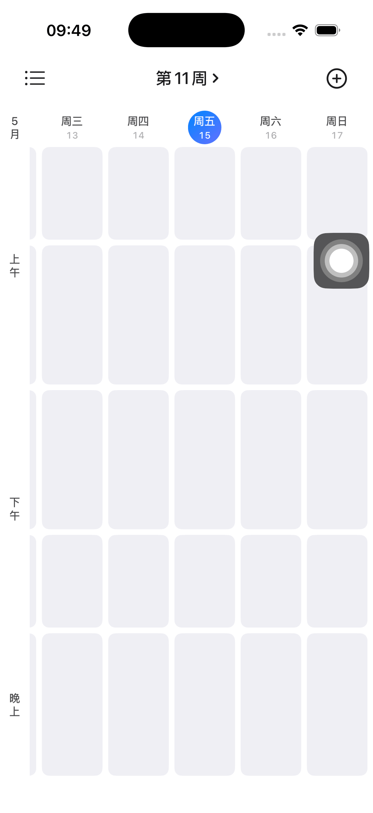
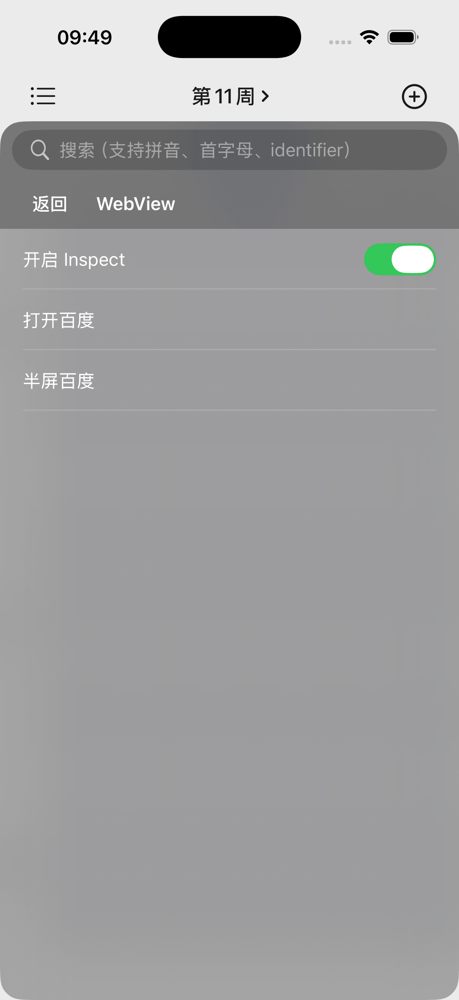

# TKDebugMenu 使用说明

TKDebugMenu 是一个 iOS 调试菜单库，用来把各业务模块的调试入口声明成独立的 `DebugMenuItem`，再通过宏自动注册到悬浮调试菜单中。

## 效果预览

| 悬浮入口 | 调试菜单 |
| --- | --- |
|  |  |

## 核心概念

- `DebugMenuItem`：一个菜单声明单元，类似“一个模块贡献一组调试菜单”。
- `menu`：`DebugMenuItem` 里的 DSL 属性，用来声明分组、动作和开关。
- `@DebugMenuEntry`：自动注册宏，由 `TKMacros` 提供。`TKDebugMenu` 已通过 `@_exported import TKMacros` 导出，业务侧只需要 `import TKDebugMenu`。
- `DebugMenu.register(...)`：手动注册入口。适合按条件注册或不使用宏的场景。
- `DebugMenuNode`：菜单树内部节点模型，通常只会在 action/switch 回调参数里用到。

## 基本用法

定义一个调试菜单：

```swift
import TKDebugMenu

@DebugMenuEntry
struct NetworkDebugMenu: DebugMenuItem {
    var menu: [DebugMenuNode] {
        DebugMenuGroup("Network", identifier: "network") {
            DebugMenuAction("Clear Cache", identifier: "network.clearCache") { _ in
                URLCache.shared.removeAllCachedResponses()
            }

            DebugMenuSwitch(
                "Use Mock API",
                identifier: "network.mockAPI",
                isOn: { MockAPI.shared.isEnabled }
            ) { item in
                MockAPI.shared.isEnabled = item.isOn
            }
        }
    }
}
```

展示调试菜单：

```swift
DebugMenu.show()
```

`show()` 会自动调用 `registerAll()`，扫描并注册所有带 `@DebugMenuEntry` 的菜单类型。

## DSL 节点

### DebugMenuGroup

声明一个分组，可以嵌套其他菜单节点：

```swift
DebugMenuGroup("Account", identifier: "account") {
    DebugMenuAction("Logout", identifier: "account.logout") { _ in
        AccountManager.shared.logout()
    }
}
```

### DebugMenuAction

声明一个点击后执行的动作：

```swift
DebugMenuAction("Reset Onboarding", identifier: "onboarding.reset") { _ in
    UserDefaults.standard.removeObject(forKey: "hasSeenOnboarding")
}
```

### DebugMenuInfo

声明一个纯展示项，不执行任何动作，适合展示当前版本、用户 ID、配置说明等信息：

```swift
DebugMenuInfo(
    "Current User",
    identifier: "account.currentUser",
    subtitle: AccountManager.shared.currentUserId
)
```

### DebugMenuSwitch

声明一个带状态展示的开关：

```swift
DebugMenuSwitch(
    "Enable Feature X",
    identifier: "featureX.enabled",
    isOn: { FeatureFlags.shared.isFeatureXEnabled }
) { item in
    FeatureFlags.shared.isFeatureXEnabled = item.isOn
}
```

`isOn` 会在列表刷新时重新读取，适合绑定到真实业务状态。

### DebugMenuSelection

声明一个单选配置组，适合环境切换、地区切换等互斥状态。点击 group 会进入选项列表，当前选中的 option 会显示对勾；点击其他 option 会立即触发 `onChange`。

```swift
public enum APIEnvironment: String, CaseIterable {
    case sit
    case beta
    case prod
}

DebugMenuSelection(
    "API Environment",
    identifier: "api.environment",
    subtitle: "当前环境",
    options: APIEnvironment.allCases,
    selected: { apiEnv },
    title: { $0.rawValue }
) { environment in
    apiEnv = environment
}
```

`selected` 会在列表刷新时重新读取，`onChange` 收到的是新选中的 `Option`。

### DebugMenuCheckboxGroup

声明一个多选配置组，适合 feature flags、调试模块开关等场景。点击 group 会进入选项列表，当前选中的 option 会显示对勾；点击 option 会立即触发 `onChange`。

```swift
enum DebugModule: String, CaseIterable {
    case network
    case apiLog
    case mock
}

DebugMenuCheckboxGroup(
    "Debug Modules",
    identifier: "debug.modules",
    subtitle: "选择启用的调试模块",
    options: DebugModule.allCases,
    selected: { DebugSettings.shared.enabledModules },
    title: { $0.rawValue },
    subtitle: { "module.\($0.rawValue)" }
) { selectedModules in
    DebugSettings.shared.enabledModules = selectedModules
}
```

`selected` 会在列表刷新时重新读取，`onChange` 收到的是切换后的完整 `Set<Option>`。

## identifier 与合并规则

请给稳定菜单配置稳定的 `identifier`。默认 identifier 是 UUID，只适合临时菜单。

同一个 parent 下遇到相同 `identifier` 时：

- 两个都是 `DebugMenuGroup`：会合并 children。
- action/switch 或类型不同：后注册的节点会覆盖先注册的节点。
- checkbox group 按普通节点处理，相同 identifier 时后注册覆盖先注册。

这允许不同模块把入口挂到同一个分组里：

```swift
struct NetworkDebugMenu: DebugMenuItem {
    var menu: [DebugMenuNode] {
        DebugMenuGroup("Network", identifier: "network") {
            DebugMenuAction("Clear Cache", identifier: "network.clearCache") { _ in }
        }
    }
}

struct APIDebugMenu: DebugMenuItem {
    var menu: [DebugMenuNode] {
        DebugMenuGroup("Network", identifier: "network") {
            DebugMenuAction("Dump Request Log", identifier: "network.dumpRequestLog") { _ in }
        }
    }
}
```

最终菜单里只会有一个 `Network` 分组，里面包含两个 action。

## 排序

每个节点都支持 `sortOrder`：

```swift
DebugMenuGroup("Network", identifier: "network", sortOrder: 10) {
    DebugMenuAction("Clear Cache", identifier: "network.clearCache", sortOrder: 20) { _ in }
    DebugMenuAction("Dump Request Log", identifier: "network.dumpRequestLog", sortOrder: 10) { _ in }
}
```

排序规则：

1. 先按 `sortOrder` 从小到大。
2. `sortOrder` 相同时按标题做本地化排序。

## 搜索

菜单面板内置搜索，支持：

- 标题搜索。
- 拼音和首字母搜索。
- `identifier` 搜索。

因此建议 identifier 使用可读的层级命名，例如 `network.clearCache`、`account.logout`。

## 通过 identifier 控制菜单

外部路由可以通过稳定的 `identifier` 控制调试菜单项。控制方法会自动执行 `DebugMenu.registerAll()`，不需要先展示菜单。

```swift
DebugMenu.triggerAction(identifier: "network.clearCache")

DebugMenu.setSwitch(
    identifier: "featureX.enabled",
    isOn: true
)

DebugMenu.selectOption(
    identifier: "api.environment.sit"
)

DebugMenu.setCheckboxOption(
    identifier: "debug.modules.network",
    isOn: true
)
```

selection 和 checkbox 需要传完整 option identifier。group identifier 只是菜单入口，option identifier 才是具体可选项：

```swift
DebugMenuSelection(
    "API Environment",
    identifier: "api.environment",
    options: APIEnvironment.allCases,
    selected: { apiEnv },
    title: { $0.rawValue }
) { environment in
    apiEnv = environment
}
```

上面这个 group 的 identifier 是 `api.environment`，`sit` option 的 identifier 是 `api.environment.sit`。如果要通过路由切到 sit，应调用：

```swift
DebugMenu.selectOption(identifier: "api.environment.sit")
```

控制 API 返回 `Result<Void, DebugMenuControlError>`。identifier 不存在会返回 `itemNotFound`，类型不匹配会返回 `unsupportedKind`。

## 自动注册

推荐使用 `@DebugMenuEntry` 自动注册菜单：

```swift
@DebugMenuEntry
struct NetworkDebugMenu: DebugMenuItem {
    var menu: [DebugMenuNode] {
        DebugMenuGroup("Network", identifier: "network") {
            DebugMenuAction("Clear Cache", identifier: "network.clearCache") { _ in }
        }
    }
}
```

`@DebugMenuEntry` 的宏声明和实现都在 `TKMacros`。`TKDebugMenu` 依赖 `TKMacros`，并通过 `@_exported import TKMacros` 导出宏声明，所以业务模块只需要导入 `TKDebugMenu`。

自动注册会把菜单类型写入 `__DATA_CONST,__tk_debug_menu` Mach-O section，运行时由 `DebugMenu.registerAll()` 扫描注册。

如果你需要按条件注册，也可以手动注册某个 item 类型：

```swift
DebugMenu.register(NetworkDebugMenu.self)
```

## 推荐实践

- 每个业务模块定义自己的 `DebugMenuItem`，避免集中维护一个巨大菜单文件。
- 稳定入口一定写稳定 `identifier`，不要依赖默认 UUID。
- 共享分组使用同一个 group identifier，例如 `network`、`account`、`featureFlags`。
- action/switch 的 identifier 建议带上父级前缀，例如 `network.clearCache`。
- selection/checkbox 的路由控制请使用完整 option identifier，例如 `api.environment.sit`。
- 菜单回调默认在主线程上下文使用，适合触发 UI、弹窗和调试操作。
