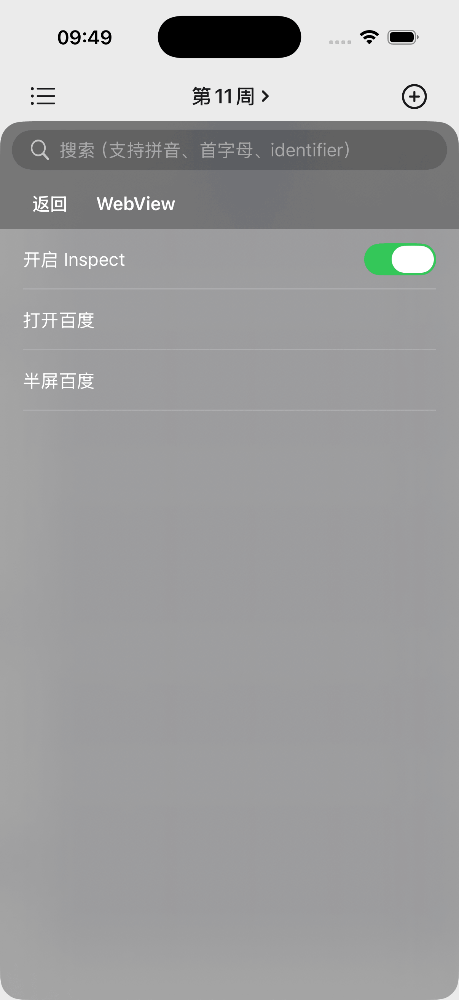

# DebugMenuKit

DebugMenuKit 是一个轻量级的 iOS 悬浮调试菜单库。各业务模块可以声明自己的 `DebugMenuItem`，并通过 `@DebugMenuEntry` 自动注册。

## 效果预览

| 悬浮按钮 | 调试菜单 |
| --- | --- |
|  |  |

## 环境要求

- iOS 15.0 或更高版本
- Swift 6.0 或更高版本
- Xcode 26 或更高版本

## 安装

### Swift Package Manager

在 Xcode 中添加本仓库作为 package dependency，并选择 `DebugMenuKit` product。

使用 `@DebugMenuEntry` 的 target 需要在 Swift 编译参数中启用 `-enable-experimental-feature SymbolLinkageMarkers`。

#
## 基本用法

```swift
import DebugMenuKit

@DebugMenuEntry
struct NetworkDebugMenu: DebugMenuItem {
    var menu: [DebugMenuNode] {
        DebugMenuGroup("Network", identifier: "network") {
            DebugMenuAction("Clear Cache", identifier: "network.clearCache") { _ in
                URLCache.shared.removeAllCachedResponses()
            }

            DebugMenuSwitch(
                "Use Mock API",
                identifier: "network.mockAPI",
                isOn: { MockAPI.shared.isEnabled }
            ) { item in
                MockAPI.shared.isEnabled = item.isOn
            }
        }
    }
}
```

在主线程上下文展示菜单：

```swift
DebugMenu.show()
```

`show()` 会自动调用 `registerAll()`，发现所有带有 `@DebugMenuEntry` 的类型。需要按条件注册时，可以使用 `DebugMenu.register(NetworkDebugMenu.self)`。

## 菜单节点

- `DebugMenuGroup`：可以嵌套其他节点的分组。
- `DebugMenuAction`：点击后执行的动作。
- `DebugMenuInfo`：只读信息项，可带详情文本。
- `DebugMenuSwitch`：由状态 provider 驱动的开关。
- `DebugMenuSelection`：单选配置组。
- `DebugMenuCheckboxGroup`：多选配置组。

需要通过外部接口控制，或需要跨模块合并的菜单项，请使用稳定的 identifier。同一个 parent 下 identifier 相同的 group 会合并；其他重复 identifier 会由后注册的节点覆盖。

控制 API 返回 `Result`：

```swift
DebugMenu.triggerAction(identifier: "network.clearCache")
DebugMenu.setSwitch(identifier: "network.mockAPI", isOn: true)
DebugMenu.selectOption(identifier: "api.environment.sit")
DebugMenu.setCheckboxOption(identifier: "debug.modules.network", isOn: true)
```

搜索支持标题、可用时的拼音/首字母以及 identifier。

## 从 TKDebugMenu 迁移

修改依赖名称和 import：

```swift
import DebugMenuKit
```

`DebugMenu`、`DebugMenuItem`、`DebugMenuNode` 等主要公开 API 名称保持不变。


## License

DebugMenuKit 使用 MIT License，详见 [LICENSE](LICENSE)。

English documentation: [README.md](README.md)

## 测试与发布

采用标准 SwiftPM 包结构：`Package.swift`、`Sources/`、`Tests/`。仅支持 SwiftPM，宏从源码编译，历史版本保持不变。

```sh
bash Scripts/test-macros.sh
bash Scripts/test-ios.sh
```

GitHub Actions 在 PR、main 更新和版本 tag 时执行宿主宏测试及 iOS 包测试。运行时测试覆盖真实宏展开和自动注册/数据库断言。xcodebuild 使用 pipefail 和 xcbeautify；失败时也上传日志与 xcresults。数字版本 tag 的全部 CI 任务通过后才创建 GitHub Release。移除本地发布编排、CocoaPods 和预编译宏分发。
